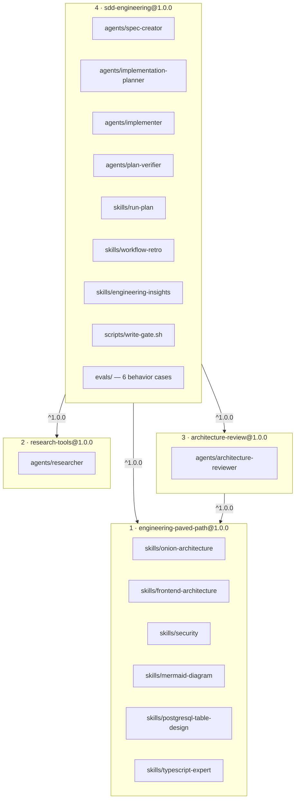
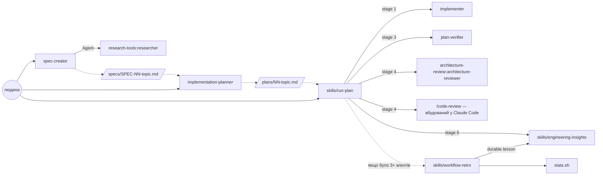
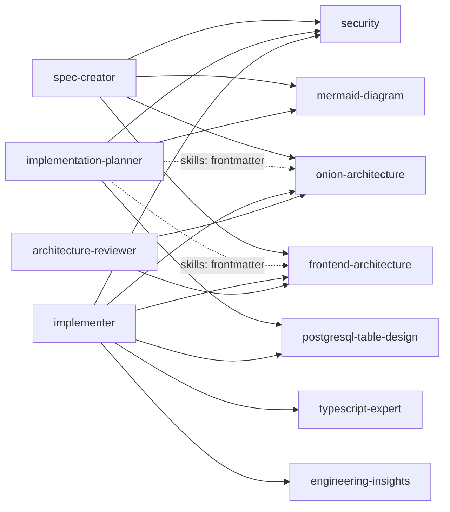

# SDD Engineering + dependency plugins — специфікація

Робочий документ. Заголовки англійські, бо це структура, яку індексує решта репозиторію;
проза українська, бо цей файл читає людина, яка його затверджує. Лежить у `docs/tmp/`, отже
не потрапляє в каталог сайту (`scripts/build-index.py` бере тільки `docs/*.md` верхнього рівня).

## Context

`plugins/` порожній, `.claude-plugin/marketplace.json` має `"plugins": []`. Перший реліз
каталогу — це витяг SDD workflow з `/Users/Vitalik/WebstormProjects/dev-digest` у чотири
плагіни: один робочий (`sdd-engineering`) і три залежності, які корисні окремо.

Мета не «скопіювати `.claude/`», а зробити пакет, який працює в чужому репозиторії. Саме тому
більша частина роботи нижче — не копіювання, а редакційний прохід: у вихідних файлах DevDigest
зашитий у прозу, а не в конфіг.

## 1. Inventory — що переносимо, що ні

### 1.1 Чотири групи

| Група | Що це в DevDigest | Доля |
| :--- | :--- | :--- |
| Reusable | 6 агентів, 3 workflow-скіли, 2 архітектурні скіли, стек-скіли, 2 скрипти | у плагіни, після редакційного проходу |
| Project-specific | `AGENTS.md`/`CLAUDE.md`, `INSIGHTS.md` (227 КБ), `specs/`, `plans/`, `reviewer-core/`, `server/`, `client/`, `pnpm arch*`, dependency-cruiser rules | лишається в DevDigest |
| Optional integrations | `.mcp.json`, `evals/proxy/` (LiteLLM + Docker), `gh` виклики | не входить у перший реліз |
| Local residue | `.reviews/`, `.retro/`, `.pr-self-review/`, `.screenshots/`, `evals/results/`, `evals/node_modules/` | не переносимо взагалі |

### 1.2 Компоненти першого релізу

Джерела — реальні файли, я їх прочитав. Розмір важливий: `description` кожного скіла коштує
контекст **завжди**, тіло — на виклику.

| Компонент | Джерело | Розмір | Owner | Consumer |
| :--- | :--- | :--- | :--- | :--- |
| `spec-creator` | `.claude/agents/spec-creator.md` | 30 КБ, 445 рядків | sdd-engineering | людина, перед планом |
| `implementation-planner` | `.claude/agents/implementation-planner.md` | 29 КБ, 472 | sdd-engineering | людина, після спеки |
| `implementer` | `.claude/agents/implementer.md` | 23 КБ, 357 | sdd-engineering | `run-plan`, stage 1 |
| `plan-verifier` | `.claude/agents/plan-verifier.md` | 15 КБ, 256 | sdd-engineering | `run-plan`, stage 3 |
| `run-plan` | `.claude/skills/implement/` (2 файли) | 26 КБ | sdd-engineering | `/sdd-engineering:run-plan` |
| `workflow-retro` | `.claude/skills/run-retrospective/` | 13 КБ | sdd-engineering | після мультиагентного запуску |
| `engineering-insights` | `.claude/skills/engineering-insights/` | 5 КБ | sdd-engineering | кінець будь-якої сесії |
| `stats.sh` | `scripts/run-retrospective/stats.sh` | 6 КБ | sdd-engineering | `workflow-retro`, крок 1 |
| `write-gate.sh` | `scripts/spec-creator/write-gate.sh` | 3.5 КБ | sdd-engineering | PreToolUse у `spec-creator` |
| `researcher` | `.claude/agents/researcher.md` | 8 КБ, 156 | research-tools | `spec-creator`; окремо |
| `architecture-reviewer` | `.claude/agents/architecture-reviewer.md` | 11 КБ, 196 | architecture-review | `run-plan`, stage 4; окремо |
| `onion-architecture` | `.claude/skills/onion-architecture/` (4 файли після витягу) | 47 КБ | engineering-paved-path | planner (`skills:`), implementer, reviewer, spec-creator |
| `frontend-architecture` | `.claude/skills/frontend-architecture/` (5 файлів) | 67 КБ | engineering-paved-path | planner (`skills:`), implementer, reviewer, spec-creator |
| `security` | `.claude/skills/security/` (4 файли) | 53 КБ | engineering-paved-path | spec-creator (`## Untrusted inputs`), planner, implementer |
| `mermaid-diagram` | `.claude/skills/mermaid-diagram/` (2 файли) | 17 КБ | engineering-paved-path | spec-creator (діаграма), planner |
| `typescript-expert` | `.claude/skills/typescript-expert/` (5 файлів) | 39 КБ | engineering-paved-path | implementer, planner |
| `postgresql-table-design` | `.claude/skills/postgresql-table-design/` (1 файл) | 15 КБ | engineering-paved-path | planner, implementer |

**Перейменування.** У DevDigest скіл називається `implement`, не `run-plan`, і
`run-retrospective`, не `workflow-retro`. Перейменовуємо один раз, зараз, під час витягу:
після релізу перейменування скіла — це **major** bump (`docs/releasing.md`), бо користувач
викликає його як `/plugin:skill`.

### 1.3 Скіли вшиті в агентів таблицями маршрутизації

Це головне, чого не видно з переліку каталогу. Три агенти першого релізу не «можуть скористатися»
скілами — вони мають **таблиці, які кажуть, який скіл відкрити перед яким кроком**:

| Агент | Рядки | Що робить таблиця |
| :--- | :--- | :--- |
| `spec-creator` | 270–282 | 4 скіли відкрити перед конкретною секцією спеки; решту 8 названо як «не твої» |
| `implementation-planner` | 283–299 | 8 скілів «перед плануванням кроку, що торкається…» |
| `implementer` | 178–212 | 9 обов'язкових + 3 «великі, не відкривай спекулятивно» + `pr-self-review` у «ніколи» |
| `architecture-reviewer` | 91, 110, 118 | `onion-architecture` і `frontend-architecture` як джерело правил, за якими він судить |

Наслідок для D2: **скіл, який не їде, треба видалити рядком із трьох таблиць**, а не просто не
покласти в `engineering-paved-path`. І навпаки — додати його потім означає повернути рядки, тобто
minor bump не лише `engineering-paved-path`, а й `sdd-engineering`. Дешевий момент вирішити — цей.

### 1.4 Що свідомо не входить

| Не входить | Причина |
| :--- | :--- |
| `pr-self-review` (111 КБ, 6 файлів) | тримається на `scripts/pr-self-review/scope.sh`, `worktreeHash`, `gate.sh` і push-hook DevDigest. Це не редакційний прохід, це переписування |
| `test-writer`, `doc-writer` | `run-plan` їх не диспетчерить (його §11 каже чому); без них у плагіні немає споживача |
| `architecture-reviewer-lite` | контрольний варіант для eval-гарнесу. Він агент, тобто користувач побачить його в списку — шум. Повертаємо тільки разом з eval, який його вимірює |
| `dependency-checker` | окремий продукт, свій реліз |
| Стек-скіли: `fastify-best-practices` (170 ток. always), `zod` (83), `react-testing-library` (75), `react-best-practices` (65), `next-best-practices` (46) | D2 — поза стеком, на який націлений реліз. Пишуться пізніше |
| `drizzle-orm-patterns` (112 ток. always) | цільова ORM — Prisma. Скіла `prisma` в DevDigest немає, отже це написання з нуля, не витяг. `engineering-paved-path@1.1.0` |

## 2. Dependency graph

```
sdd-engineering@1.0.0
├── engineering-paved-path@^1.0.0
├── research-tools@^1.0.0
└── architecture-review@^1.0.0
    └── engineering-paved-path@^1.0.0
```

### 2.1 Плагіни, їхній склад і напрям залежності

Стрілка читається «залежить від». Номер у назві плагіна — порядок збирання (§9): будуємо знизу
вгору, бо констрейнт резолвиться проти тега, якого ще немає.



`engineering-paved-path` має двох незалежних споживачів — це і є причина, чому він окремий
плагін, а не папка всередині `sdd-engineering`. `research-tools` не залежить ні від чого:
`researcher` не викликає жодного скіла.

### 2.2 Що кого викликає під час роботи

Це те, заради чого пакет існує. Суцільна стрілка — диспатч агента, пунктир — артефакт на диску.



Дві межі плагінів перетинаються тут: `spec-creator` → `research-tools:researcher` і
`run-plan` → `architecture-review:architecture-reviewer`. Обидві — namespaced посилання, і обидві
перевіряються запуском з `--plugin-dir` до релізу.

`plan-verifier` не має ні `Skill`, ні `Agent` — він єдиний лист у цьому графі, і це навмисно:
верифікатор, що відкрив скіл, починає судити код проти скіла замість проти плану.

### 2.3 Хто які скіли відкриває



Усі шість скілів `engineering-paved-path` мають щонайменше двох споживачів — це та перевірка,
яку вимагає крок 2 лабораторної. `engineering-insights` єдиний живе в `sdd-engineering`, бо його
викликає і `implementer`, і стадія 6 `run-plan`.

### 2.4 Маніфест

`sdd-engineering/.claude-plugin/plugin.json`:

```json
{
  "$schema": "https://json.schemastore.org/claude-code-plugin-manifest.json",
  "name": "sdd-engineering",
  "description": "Spec → plan → implement → verify, as four agents and three skills.",
  "version": "1.0.0",
  "author": { "name": "Vitalii Holubinka" },
  "license": "MIT",
  "keywords": ["sdd", "spec-driven", "planning", "orchestration"],
  "dependencies": [
    { "name": "engineering-paved-path", "version": "^1.0.0" },
    { "name": "research-tools", "version": "^1.0.0" },
    { "name": "architecture-review", "version": "^1.0.0" }
  ]
}
```

Посилання між плагінами — тільки namespaced: `engineering-paved-path:onion-architecture`,
`research-tools:researcher`, `architecture-review:architecture-reviewer`.

**Ризик, який треба перевірити емпірично, а не припустити:** frontmatter-поле `skills:` в
`implementation-planner` зараз має `onion-architecture, frontend-architecture` — локальні імена.
Чи приймає це поле plugin-scoped ім'я, перевіряємо запуском (`--plugin-dir` з обома плагінами)
**до** релізу. Якщо ні — скіли залишаються, але посилання на них переїжджає в тіло промпту, де
формат вільний.

## 3. Plugin composition

```
plugins/
├── engineering-paved-path/          # 6 скілів, 20 файлів, ~200 КБ, 514 ток. always-on
│   ├── .claude-plugin/plugin.json
│   ├── skills/onion-architecture/        # 122 ток. always / 2934 onLoad
│   ├── skills/frontend-architecture/     # 117 / 1966
│   ├── skills/security/                  #  72 / 3345
│   ├── skills/mermaid-diagram/           #  63 / 1794
│   ├── skills/postgresql-table-design/   #  44 / 3952
│   ├── skills/typescript-expert/         #  96 / 3619, несе scripts/ts_diagnostic.py
│   └── README.md
├── research-tools/
│   ├── .claude-plugin/plugin.json
│   ├── agents/researcher.md
│   └── README.md
├── architecture-review/
│   ├── .claude-plugin/plugin.json          # depends: engineering-paved-path@^1.0.0
│   ├── agents/architecture-reviewer.md
│   └── README.md
└── sdd-engineering/
    ├── .claude-plugin/plugin.json          # depends: усі три
    ├── agents/{spec-creator,implementation-planner,implementer,plan-verifier}.md
    ├── skills/run-plan/{SKILL.md,fix-rounds.md}
    ├── skills/workflow-retro/{SKILL.md,stats.sh}
    ├── skills/engineering-insights/SKILL.md
    ├── scripts/write-gate.sh
    ├── evals/
    ├── README.md
    ├── CHANGELOG.md
    └── COMPATIBILITY.md
```

`scripts/`, не `bin/` — `bin/` ламає роздачу через claude.ai organization settings (`W003`).
`stats.sh` кладемо **всередину скіла**, бо його викликає лише цей скіл і посилання тоді
`${CLAUDE_SKILL_DIR}/stats.sh`. `write-gate.sh` — у `scripts/` плагіна, бо його викликає hook
з frontmatter агента, а це plugin-level: `${CLAUDE_PLUGIN_ROOT}/scripts/write-gate.sh`.

## 4. Editorial pass — що конкретно переписати

Це головна частина роботи. Нижче — знайдене в файлах, не гіпотези.

### 4.1 Абсолютна прив'язка до DevDigest

| Файл | Що зашито | Стає |
| :--- | :--- | :--- |
| `spec-creator` | hook `bash "${CLAUDE_PROJECT_DIR:-.}/scripts/spec-creator/write-gate.sh"` | `${CLAUDE_PLUGIN_ROOT}/scripts/write-gate.sh`, exec-форма, каталог спек — аргумент |
| `spec-creator` | модулі `server`, `client`, `reviewer-core` як список для `<module>/specs/` | будь-який каталог із `specs/` поруч; список — з конфігу (§5) |
| `spec-creator` | заборона `e2e/specs/**` за іменем | правило «каталог спек рівно один, решта — ні», без імені |
| `write-gate.sh` | шлях `specs/`, `<module>/specs/`, `e2e/specs/**` | той самий gate, але шлях приходить аргументом; поведінка без `jq` уже описана (deny) |
| `implementation-planner` | `reviewer-core` ×4, `pnpm test:it` | назви модулів і команди гейтів — вхід, не константа |
| `implementer` | `pnpm arch`, `pnpm arch:baseline` ×2, `pnpm typecheck`, `pnpm test`, `pnpm lint`, `reviewer-core` ×4 | гейти з плану; поведінки за їх відсутності — §5.2 |
| `plan-verifier` | `pnpm arch:baseline`, `PR_SELF_REVIEW_SKIP=1` | «ніколи не переписуй baseline і не вимикай гейт» — правило без імені команди |
| `architecture-reviewer` | «дванадцять dependency-cruiser rules», `pnpm arch` ×6, `reviewer-core`, лінія Server/Client у `client/` | читає repo-local architecture docs (§5.3); статичний аналіз — опційний, за наявності |
| `engineering-insights` | таблиця `server/**→server/INSIGHTS.md`, `client/`, `reviewer-core/`, `e2e/` | правило пошуку: найближчий `INSIGHTS.md` вгору від зміненого файла, інакше кореневий |
| `run-plan` | `pr-self-review`, `doc-writer`, `test-writer`, `.branch`, порти 3000/3001, `client/AGENTS.md`, `.reviews/<branch>/` | стадії 0/2 узагальнюємо; стадії, чиї агенти не входять у реліз, — прибрати, не залишати «якщо є» |
| `workflow-retro` | `../../../scripts/run-retrospective/stats.sh`, обґрунтування через `scope.sh`/`worktreeHash` | `${CLAUDE_SKILL_DIR}/stats.sh`; вимога «звіт пише поза індексованим деревом» без DevDigest-причини |

### 4.2 Рядки скілів, яких більше немає

Шість скілів не їдуть (§1.4), тож їхні рядки треба прибрати з чотирьох місць — інакше агент
викликає `Skill`, якого не існує:

| Файл | Що правимо |
| :--- | :--- |
| `spec-creator:270-282` | таблиця «invoke before writing» лишається цілою (усі 4 скіли їдуть); абзац «Ten of the fourteen skills… are not yours» переписати — з восьми названих лишаються двоє |
| `implementation-planner:283-299` | з 8 рядків лишаються 3 — `postgresql-table-design`, `security`, `mermaid-diagram`; закриття «`react-testing-library`, `typescript-expert` and `pr-self-review` are the implementer's» → лише `typescript-expert` |
| `implementer:178-212` | головна таблиця: з 9 рядків лишаються 4 (`onion`, `frontend`, `security`, `engineering-insights`); «Also available» з 3 рядків → 2, а рядок «These three are big — 603, 202 and 431 lines» перерахувати; секція «Never» про `pr-self-review` зникає разом із ним |
| `architecture-reviewer:91,110,118` | без змін — усі три згадані скіли їдуть |

**Побічний наслідок, який треба закрити явно.** Правило планувальника «план, чий `## Constraints`
не цитує жодного правила зі скілів, писали не відкривши жодного» трималося на тому, що скіли
покривали майже будь-яку роботу. Після обрізання вони покривають архітектуру, безпеку, типи і
схему БД — але не Fastify, React, Next чи ORM. Тому правило переформульовується: цитата зі скіла
**або** з конвенцій самого репозиторію (§5.3), і в обидві таблиці додається рядок-фолбек на
repo-local доки.

### 4.3 Анекдоти

У `run-plan` і `workflow-retro` вимірювання названі через `SPEC-05`, «Export to CI», дати
(`2026-08-13`, `2026-08-26`) і `89M токенів`. Цифри — найцінніше, що там є, вони і роблять
правило переконливим. Прибираємо **ідентифікатори**, лишаємо вимірювання: «один запуск із
23 агентів» замість «SPEC-05». Посилання на `.claude/agents/README.md § Six habits` і
`AGENTS.md § What a session costs` ведуть у нікуди після витягу — або переносимо абзац у
плагін, або прибираємо посилання разом із твердженням.

### 4.4 Дублювання між агентом і скілом

`run-plan` §11 переказує вибір model tier і `effort` для агентів, у чиїх файлах ці ж поля вже
у frontmatter. Джерело правди — frontmatter; у скілі лишається тільки те, що frontmatter
виразити не може (per-dispatch override, кап у два judgement-агенти одночасно).

### 4.5 Мова виводу

Інструкції в усіх шести агентах англійські. Українською написаний **вихід**, і це чотири різні
речі, а не одна:

| Що саме | Де | Приклад |
| :--- | :--- | :--- |
| Шаблони звітів — заголовки, які агент друкує дослівно | усі 6 | `## Знахідки`, `## Перевірено проти`, `## Коротка відповідь` |
| Блок уточнення, яким агент зупиняє себе | усі 6 | `## Потрібне уточнення`, `**Що я припущу, якщо скажеш «дій»:**` |
| Сентинели порожнього значення | усі 6 | `«немає»`, `_Немає._`, `«не вказано»`, `«нічого»` |
| Нотація вимог EARS | `spec-creator` | `КОЛИ`, `ПОКИ`, `ЯКЩО … ТОДІ`, `ДЕ`, `система повинна (shall)` |
| Мітки впевненості | `researcher` | `висока` / `середня` / `низька` |

Кириличних рядків: `spec-creator` 64/445, `researcher` 32/156, `implementer` 22/357,
`implementation-planner` 20/472, `plan-verifier` 18/256, `architecture-reviewer` 14/196.
**У жодному зі скілів кирилиці немає взагалі** — 0 рядків у `run-plan`, `fix-rounds`,
`workflow-retro`, `engineering-insights` і обох архітектурних скілах.

Кожен токен, на який орієнтується інша стадія, уже англійський —
`MET`/`PARTIAL`/`NOT_MET`/`NOT_VERIFIED`, `critical`/`major`/`minor`,
`introduced`/`pre-existing`, `single-agent`/`multi-agent`, `mechanical`/`judgement`, і
`_None._` у плані. Українська — суто людський шар, тому переклад нічого в конвеєрі не ламає.

**Рішення (D3): за замовчуванням англійська.** Переклад — частина редакційного проходу кожного
агента, окремого кроку в §9 не додає. Обсяг: ~170 рядків шаблонів у шести файлах.

Розділяємо два шари, і це головне в цьому рішенні:

| Шар | Мова | Чому |
| :--- | :--- | :--- |
| Скелет — заголовки секцій, сентинели, вердикти, severity, режими | **англійська завжди, не налаштовується** | це контракт: за цими рядками одна стадія читає вихід іншої, за ними ж грейдери в evals шукають структуру. Мова, що змінюється, робить контракт нечитним |
| Проза всередині секцій — речення, питання, пояснення | англійська за замовчуванням, інша — за вибором | це те, що читає людина, і єдине, що має сенс перекладати |

Перемикач — `reportLanguage` у `sdd.config.json` (§5.1); разова вказівка в диспатчі має
пріоритет над конфігом. Автовизначення мови розмови **не** робимо: користувач вмикає іншу мову
явно, інакше плагін поводиться по-різному в однаковому репозиторії.

Сентинели теж переїжджають у скелет і стають англійськими: `«немає»` → `_None._`,
`«не вказано»` → `_not given_`. У плані `_None._` уже такий — після переходу спека і план
нарешті користуються одним значенням для «порожньо», а `run-plan` перевіряє його однією умовою.

Окремий виграш у `spec-creator`: EARS — англомовний стандарт, тож `КОЛИ`/`ПОКИ`/`ЯКЩО … ТОДІ`/`ДЕ`
повертаються до канонічних `WHEN`/`WHILE`/`IF … THEN`/`WHERE` і `the system shall`. Це не
переклад, а повернення нотації до її джерела — і зникає рядок, який велів писати ключові слова
вимог українською (`spec-creator.md:299`).

## 5. Explicit inputs

Плагін не має права припускати структуру чужого репозиторію. Три речі, які треба зробити
явними.

### 5.1 Куди пишуться spec і plan

За замовчуванням `specs/SPEC-NN-topic.md` і `plans/NN-topic.md` у корені; `<module>/specs/`
дозволений, коли робота не виходить за межі одного пакета. Перевизначається файлом
`sdd.config.json` у корені host-репозиторію:

```json
{
  "specsDir": "specs",
  "plansDir": "plans",
  "modules": ["server", "client"],
  "gates": ["pnpm typecheck", "pnpm test"],
  "scratchDir": ".sdd",
  "reportLanguage": "English"
}
```

Читається `Read`-ом самими агентами. `userConfig` у маніфесті для цього **не** годиться:
`${user_config.*}` підставляється тільки в hook/MCP/LSP-конфігах і в env скриптів, а не в
тіло промпту агента. `userConfig` лишаємо рівно для одного споживача — аргументів
`write-gate.sh`. Файла немає → діють defaults, і агент каже про це одним рядком у звіті.

### 5.2 Коли test command не знайдено

`implementer` бере команди гейтів **з плану**. План бере їх із `sdd.config.json`, а якщо і його
немає — `implementation-planner` дивиться `package.json` scripts і пропонує, що знайшов.
Якщо не знайдено нічого: план записує `gates: none found`, `implementer` не вигадує команду,
не ставить залежності і не запускає `npm test` «про всяк випадок» — він **звітує**, що
перевірити зміну автоматично неможливо, і це стає рядком у звіті `plan-verifier`. Мовчазний
зелений прогін без гейтів — найгірший з можливих виходів.

### 5.3 Що читає architecture-reviewer

Замість зашитих правил — repo-local документи, у цьому порядку: `sdd.config.json.architectureDocs`,
далі `docs/architecture*.md`, `ARCHITECTURE.md`, `**/AGENTS.md` § architecture. Не знайшов
жодного — не вигадує правил: звітує «репозиторій не описує меж» і обмежується спостереженнями
про напрям залежностей, які видно з коду. Конфіг статичного аналізу (`.dependency-cruiser.js`
тощо) читає, якщо є, як додаткове джерело.

## 6. Evals

`claude plugin eval` очікує `evals/**/case.yaml` або `prompt.md` + `graders/*.md`. У DevDigest
evals — це vitest/TypeScript гарнес (`*.eval.ts`, `*.cases.ts`, `pnpm`, LiteLLM-проксі в Docker).
**Формат несумісний, тому evals не копіюються, а пишуться заново.** Крім того, наявні там
сюїти покривають `architecture-reviewer`, `dependency-checker` і `pr-self-review` — жодної для
чотирьох SDD-агентів немає.

Перший реліз: по одному behavior-eval на агента, які перевіряють поведінку на межі, а не якість
тексту:

| Case | Очікуване |
| :--- | :--- |
| `spec-creator` отримує запит із дизайном і без відповіді на питання | ставить питання, не пише файл |
| `spec-creator` пробує писати поза `specsDir` | `write-gate.sh` блокує (exit 2) |
| `implementation-planner` отримує спеку з `assumed`-рядком | не планує, повертає питання |
| `implementer` отримує план із `## Out of scope` | не чіпає виключене; не комітить |
| `implementer` у репозиторії без тестової команди | звітує про це, не вигадує команду |
| `plan-verifier` отримує план і незавершену зміну | `NOT_MET` з `path:line`, нічого не пише на диск |

`--ablation with-without` дає дельту проти прогону без плагіна — це і є доказ, що плагін
щось робить. Fixtures — маленький синтетичний репозиторій у `evals/fixtures/`, не витяг з
DevDigest.

## 7. Marketplace, versions, tags

Реєстрація — чотири записи в наявному `.claude-plugin/marketplace.json`, без `version`
(`W004`: версія живе тільки в `plugin.json`):

```json
{ "name": "sdd-engineering", "source": "./plugins/sdd-engineering",
  "description": "Той самий рядок, що в маніфесті.",
  "category": "development", "keywords": ["sdd", "spec-driven", "orchestration"] }
```

**Порядок тегування важливий.** Констрейнти резолвляться проти git-тегів
`{plugin-name}--v{version}`; нетегована залежність із діапазоном дає `no-matching-tag`. Отже:

1. `engineering-paved-path--v1.0.0`
2. `research-tools--v1.0.0`
3. `architecture-review--v1.0.0` (уже може констрейнити 1)
4. `sdd-engineering--v1.0.0`

Кожен плагін має свій `README.md`. `CHANGELOG.md` і `COMPATIBILITY.md` — у `sdd-engineering`
(лабораторна їх вимагає саме там); для трьох залежностей сумісність — рядок у їхніх README,
поки немає чого версіонувати окремо.

`COMPATIBILITY.md`: **Claude Code >= 2.1.110** — мінімум, від якого працюють version-constrained
dependencies. Локально стоїть 2.1.251. Якщо в редакційному проході ми беремо щось новіше
(наприклад `${CLAUDE_SKILL_DIR}`), мінімум піднімається окремим рядком із посиланням на доку.

## 8. Decisions

Чотири речі, які я не вирішую сам.

**D1. Назва маркетплейсу — вирішено 2026-08-29: лишається `dev-workbench`.** Назву з
лабораторної (`dev-digest-ai-marketplace`) не беремо: `dev-workbench` — це `@suffix`, яким
встановлюють, він у README і на опублікованому сайті, і зміна нічого не дає.

**D2. Склад `engineering-paved-path` — вирішено 2026-08-29: шість скілів.** Ядро процедури —
`onion-architecture`, `frontend-architecture`, `security`, `mermaid-diagram` (без них у спеці
немає секції `## Untrusted inputs` і діаграми, а `architecture-reviewer` не має за чим судити),
плюс `typescript-expert` і `postgresql-table-design`. Разом 514 токенів always-on (після переписування trigger-опису `typescript-expert`).

Стек-скіли (React, Next, Fastify, Zod, RTL) і `prisma-patterns` пишуться пізніше, окремими
minor-релізами. Тоді ж повертаються їхні рядки в таблиці агентів (§4.2) — а це вже minor bump і
для `sdd-engineering`, бо змінюються промпти агентів.

Аргумент «великий список роздуває discovery context» виявився слабким: усі 12 скілів разом — це
1008 токенів always-on. Різали за релевантністю стеку і за тим, скільки скілів реально буде кому
тримати актуальними.

**D3. Мова звітів — вирішено 2026-08-29: англійська за замовчуванням**, інші мови вмикає
користувач через `reportLanguage`. Скелет звіту лишається англійським у будь-якому разі.
Механіка — §4.5. Наслідок для решти документа: `sdd-engineering` більше не «авторський каталог
з українським виводом», тож README починається з опису workflow, а не з попередження про мову.

**D4. `engineering-insights` — вирішено 2026-08-29: живе в `sdd-engineering`.** Там його два
споживачі: стадія 6 `run-plan` і таблиця скілів `implementer` (`implementer.md:186`, з вимогою
відкрити його на початку роботи, а не в кінці). Переїзд у `engineering-paved-path` лишається
можливим пізніше, але це major: міняється namespace виклику.

## 9. Order of work

1. `engineering-paved-path` — два скіли, маніфест, README. Найпростіший, перевіряє тулінг.
2. `research-tools` — `researcher` майже чистий (7 DevDigest-згадок, усі в прикладах).
3. `architecture-review` — найбільший редакційний прохід серед залежностей (§5.3).
4. `sdd-engineering` — агенти, потім скіли, потім скрипти, потім evals.
5. Реєстрація всіх чотирьох, потім теги в порядку §7.
6. `README.md` `sdd-engineering` пишеться **останнім**, бо описує те, що вийшло.

## 10. Verification

Після кожного плагіна:

```sh
claude plugin validate . --strict
python3 scripts/lint-structure.py          # E001 E004 E005 E006 E008, W003 W004
```

Разом, до релізу:

```sh
claude --plugin-dir ./plugins/engineering-paved-path \
       --plugin-dir ./plugins/research-tools \
       --plugin-dir ./plugins/architecture-review \
       --plugin-dir ./plugins/sdd-engineering
claude plugin eval ./plugins/sdd-engineering --ablation with-without
```

Після тестового встановлення `claude plugin list --json` не містить `dependency-unsatisfied`,
`dependency-version-unsatisfied`, `range-conflict`, `no-matching-tag`.

Два ручні прогони на **чужому** репозиторії — не на DevDigest — бо саме там видно припущення,
які редакційний прохід пропустив:

- репозиторій **з** `specs/`, тестами і архітектурними доками: повний цикл spec → plan →
  run-plan → verify;
- репозиторій **без** нічого з цього: перевіряємо §5.2 і §5.3 — агенти мають звітувати про
  відсутність, а не вигадувати.

Фінальна перевірка з кроку 4 лабораторної: жоден файл плагіна не читає нічого поза власним
каталогом, каталогами залежностей і host-репозиторієм, описаним у §5.
