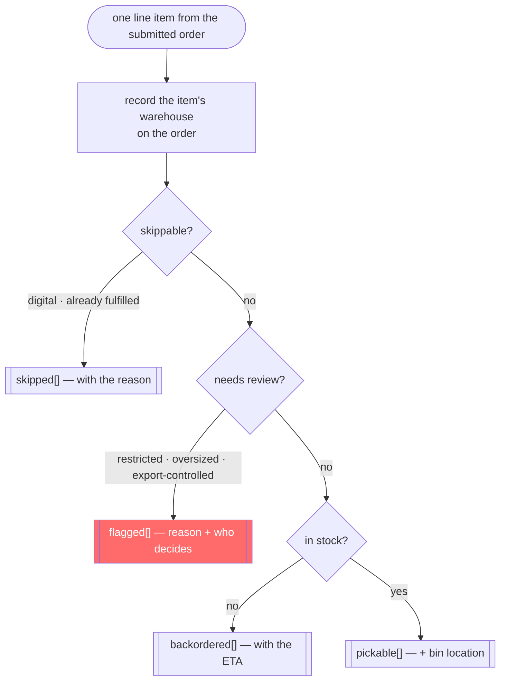
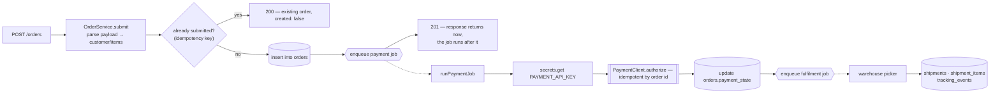
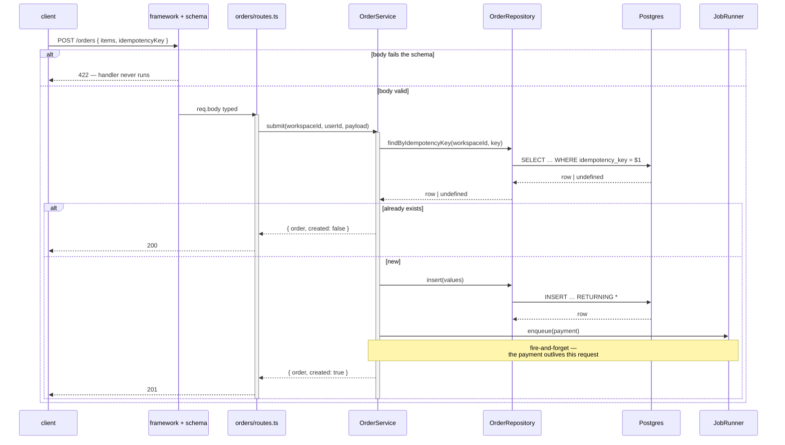
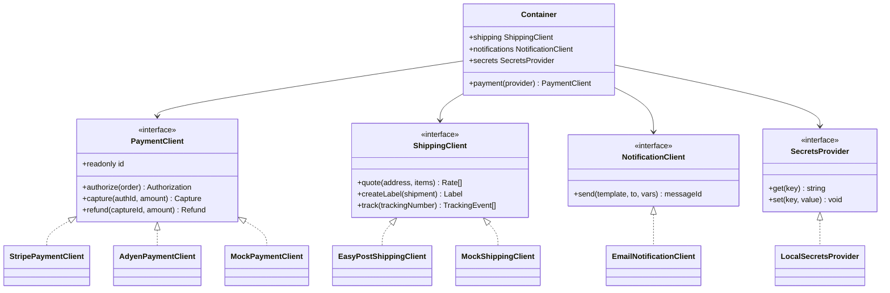
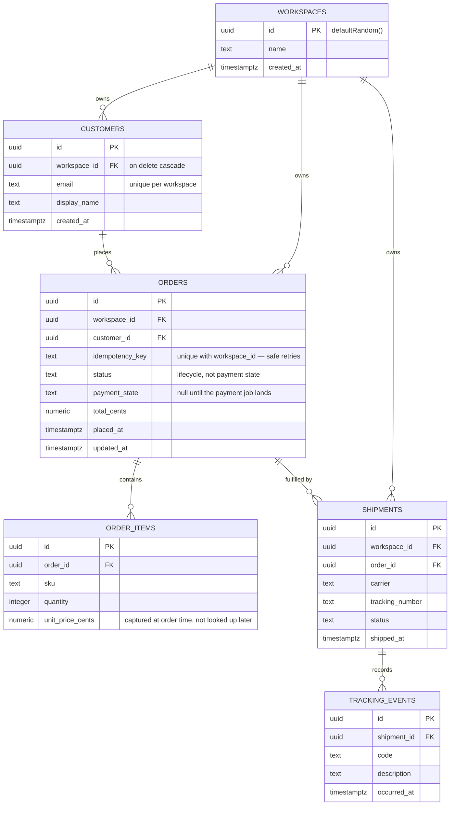
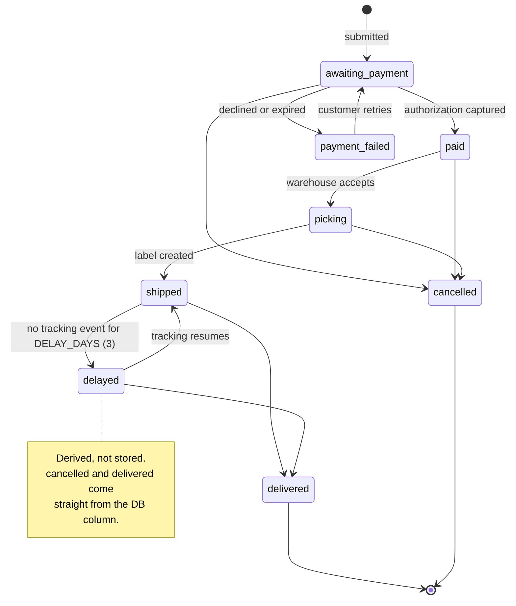
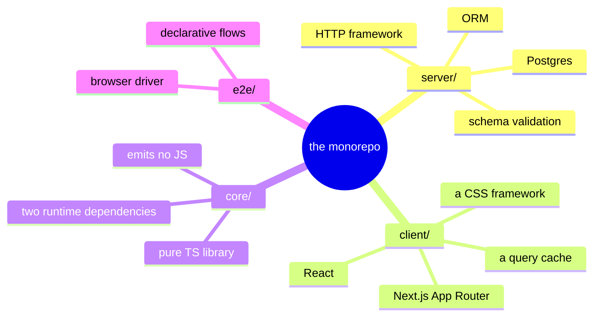

# Mermaid Diagram Examples

Ready-to-use templates, one per diagram type, in the order the Decision Guide in
[`SKILL.md`](SKILL.md) introduces them.

Every template below is drawn from one worked subject — an order-fulfilment service with an
HTTP API, background jobs, Postgres, and external payment and shipping providers. It is a
**shape to copy, not a system to reproduce**: replace the nouns with the ones in front of you.

**The note under each diagram is the point.** It says what that diagram type earns its place
for. Read those even if you skip the code.

**Anchor every diagram you draw to real code, and say where.** A diagram whose subject you
reconstructed from memory reads exactly like one you verified — that is what makes it
dangerous. Name the file you read, and re-read it before reusing the diagram later.

---

## 1. Flowchart — classifying one item against a chain of rules

A branching process with four terminal buckets, which is exactly what a flowchart is for.

**Why the warehouse is recorded first.** The two early exits below it leave the loop body, so an
item counted after them would contribute nothing. **A flowchart earns its place when the *order*
of the steps is the point** — that is the whole difference between this and a bulleted list of
the four buckets.

---

## 2. Flowchart — a request that hands off to background work

Two background jobs chained by an enqueue, which no sequence diagram would show as clearly.

**Dashed edges mean "hands off to a job", not "calls".** The response at `F` is already on the
wire while `G` runs — and drawing that distinction is most of why this diagram exists. A reader
who thinks `F` waits for `M` will design the wrong retry.

---

## 3. Sequence Diagram — one write through the rings

The canonical `route → service → repository` shape, with validation ahead of the handler.
Copy this when the flow is a plain write; reach for §2 instead when the interesting part is what
happens after the response.

**Note the ring discipline: the route never talks to `D`.** If your repository has a boundary
gate, a diagram that showed the route reaching the database would be drawing a violation — which
makes this diagram a design review as well as documentation. Draw what the rules allow, or
report the divergence.

---

## 4. Class Diagram — ports and their adapters

Use a class diagram for the *shape* of a boundary — not for tables, which is what §5 is for.

**`Container` points at the interfaces, never at the boxes on the right.** An arrow from
`Container` to `StripePaymentClient` is drawing a dependency-direction violation, and this is the
diagram type where such a violation is most visible. Note also that every port has a mock: that
is the rule, not a testing convenience.

---

## 5. ER Diagram — the tables behind one feature

Give the column types the database actually creates, so the diagram can be **checked against
`\d+ orders`** rather than believed.

**Say the tenancy rule once, in prose, rather than per table.** Every table here carries
`workspace_id` because tenancy is resolved at the route and every query filters on it. Drawing an
arrow for it eight times is noise; leaving it out entirely hides the rule.

---

## 6. State Diagram — a lifecycle where some states are derived

Mark which states are **stored** and which are **derived on read**. That distinction is
invisible in the code to anyone who has not opened the function, and it is the first thing a
reader of the diagram will get wrong.

---

## 7. Mindmap — a hierarchy with no edges worth naming

**The moment the arrows would mean something, use §1 or §3 instead.** A mindmap has no edge
semantics at all, so using one for a system with real relationships throws that information away
silently.

---

## What has no template here, and why

**Gantt** and **pie** are in the Decision Guide but have no template in this file, and that is
deliberate. Neither has a subject here that would be honest: there is no dated schedule to chart
and no measured distribution to slice.

**Inventing plausible numbers for a diagram is the same failure as seeding fake rows to make a
screen look fuller** — the picture reads as evidence and is not. Syntax for both is in
[`SKILL.md`](SKILL.md); bring your own real numbers.
